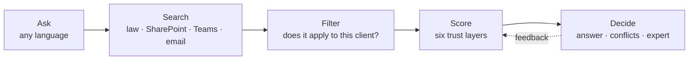

<div align="center">

# Company brain

**One answer from policies, Teams, email and the law, and the reason you can trust it.**

[Live demo](https://tavling-eight.vercel.app) · [Trust engine](src/trust-engine/README.md) · Tectonic Hackathon 2026 · SD Worx challenge

Built by team Aleida.ai: Ilke Seynaeve, Isak Andersson, Noa Gradstock


</div>

## The problem

A client asks an urgent payroll question. The answer is spread across a policy, an old manual, a Dutch guide, a Teams thread and a draft email, and they disagree. Search finds all of them, but it can't tell you which one to trust.

Company brain takes the consultant from *"I found something"* to *"I understand why I can rely on it"*.

## How it works



| | Step | What happens |
|---|---|---|
| 1 | **Ask** | Type a question or pick an example. Gemini understands it and routes it to a topic. |
| 2 | **Search** | Every source that mentions the topic is collected. |
| 3 | **Filter** | Sources for another country, sector or client are set aside, with the reason shown. |
| 4 | **Score** | Each claim is scored on six layers: authority, freshness, corroboration, consistency with the law, relevance, feedback. |
| 5 | **Decide** | The trusted answer, the sources that disagree, and which expert to ask. |
| 6 | **Learn** | Users mark an answer correct, wrong, outdated or "not my case", and the scores update. |

<table>
<tr>
<td width="50%"><br><sub><b>1. Ask</b> a question for a specific client</sub></td>
<td width="50%"><br><sub><b>2–4. Choose</b>: 6 found, 5 apply, 2 trusted, 1 to read first</sub></td>
</tr>
</table>

## Why you can trust it

Gemini only interprets the question. The score comes from a deterministic engine: the same input always gives the same score, and every point is explained. Nothing is hidden in a black box. Weights and rules are in [src/trust-engine/config.ts](src/trust-engine/config.ts).

## Run it

Requires Node 20+.

```bash
npm install
npm run dev      # http://localhost:3000
npm test         # trust engine tests
```

Optional: put `GEMINI_API_KEY=...` in `.env.local` for free-text questions. Without a key the app falls back to keyword matching and still works end to end.

The live demo runs on Vercel (project `tavling`), with `GEMINI_API_KEY` set as an encrypted environment variable. Pushing to GitHub does not deploy automatically yet; run `vercel deploy --prod` from the repo folder.

## Structure

| Path | What |
|---|---|
| `src/app/` | The demo page (ask → search → trust funnel → answer) and API routes under `api/trust/` |
| `src/trust-engine/` | Scoring engine, weights in `config.ts`, tests |
| `src/lib/gemini-match.ts` | Gemini question routing |
| `data/salary/` | Fictional source files (policies, Teams exports, emails). The engine reads claims from `sources.json` and quotes from the files. The test questions in `sources.json` run as part of `npm test` |

## Unfinished

- Claims are listed by hand in `data/salary/sources.json` (the quotes are read from the files). Extracting claims from new documents automatically with an LLM is not built yet.
- Sick leave, overtime and flexi-jobs have no data files yet and use mock claims from `src/trust-engine/mock/`.
- No real login: the demo user is fixed, and feedback is stored in memory. It resets on restart and is not shared between server instances on Vercel.
- All people, clients, legal references and amounts are fictional.
