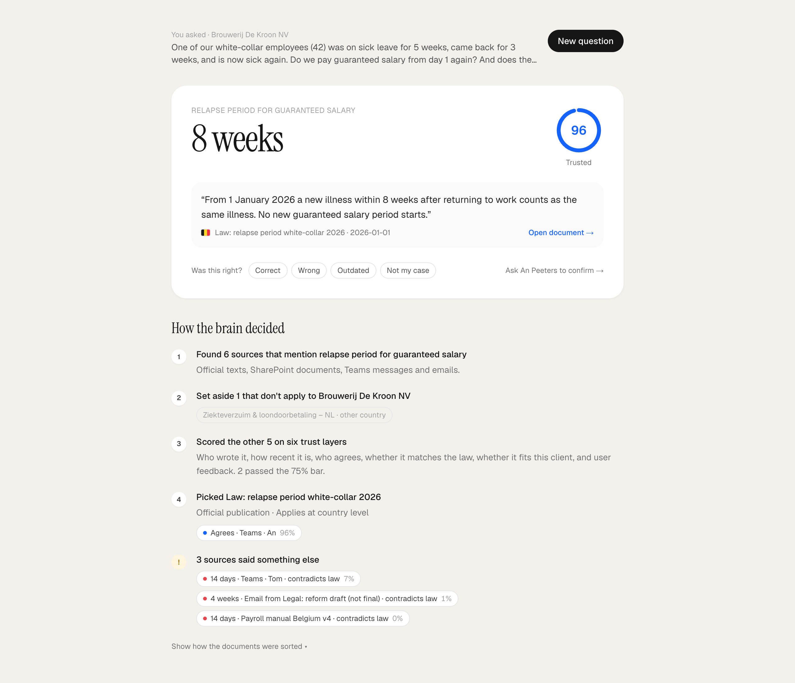
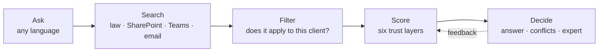
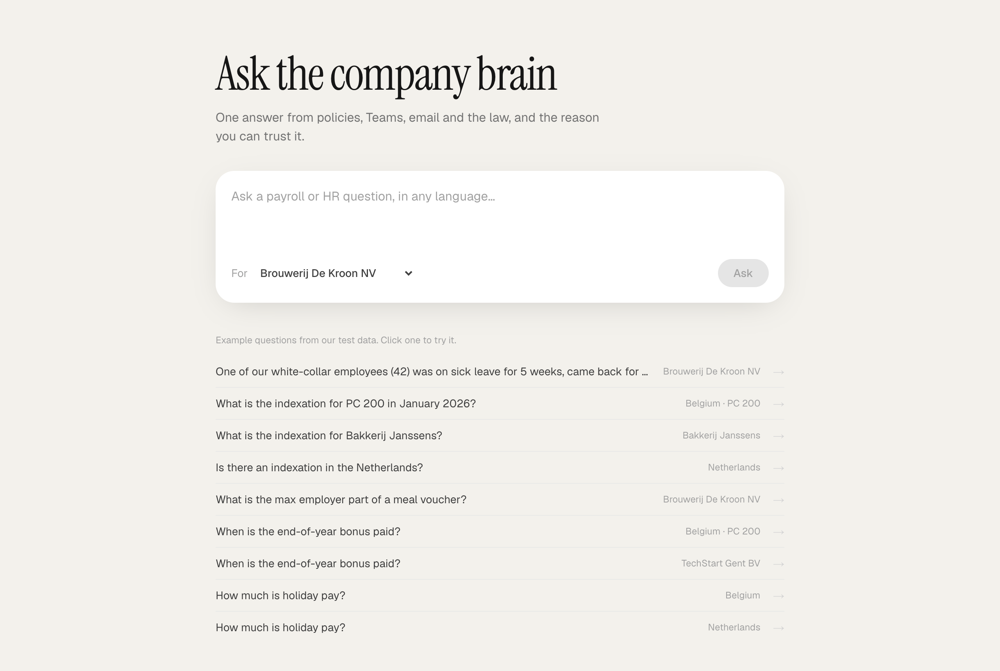
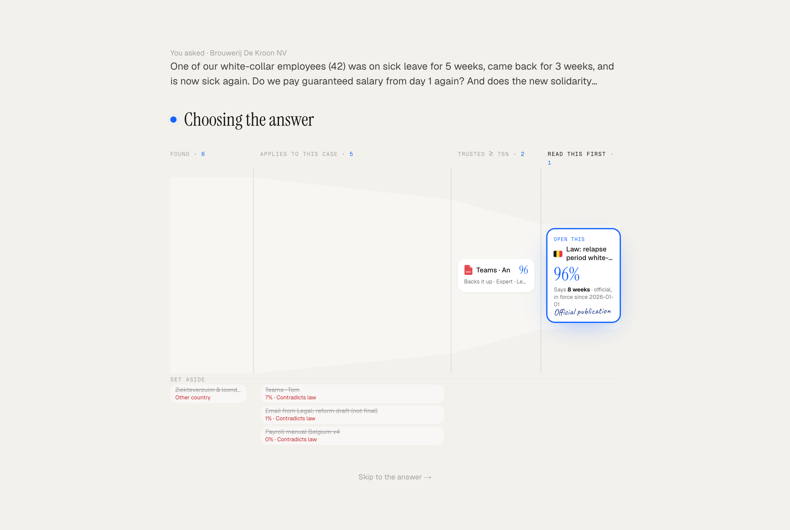

<div align="center">

# Company brain

**One answer from policies, Teams, email and the law, and the reason you can trust it.**

[Live demo](https://tavling-eight.vercel.app) · [Trust engine](src/trust-engine/README.md) · Tectonic Hackathon 2026 · SD Worx challenge

Built by team Aleida.ai: Ilke Seynaeve, Isak Andersson, Noa Gradstock



</div>

## The problem

A client asks an urgent payroll question. The answer is spread across a policy, an old manual, a Dutch guide, a Teams thread and a draft email, and they disagree. Search finds all of them, but it can't tell you which one to trust.

Company brain takes the consultant from *"I found something"* to *"I understand why I can rely on it"*.

## How it works



| | Step | What happens |
|---|---|---|
| 1 | **Ask** | Type a question or pick an example. Gemini understands it and routes it to a topic. |
| 2 | **Search** | Every source that mentions the topic is collected. |
| 3 | **Filter** | Sources for another country, sector or client are set aside, with the reason shown. |
| 4 | **Score** | Each claim is scored on six layers: authority, freshness, corroboration, consistency with the law, relevance, feedback. |
| 5 | **Decide** | The trusted answer, the sources that disagree, and which expert to ask. |
| 6 | **Learn** | Users mark an answer correct, wrong, outdated or "not my case", and the scores update. |

<table>
<tr>
<td width="50%"><br><sub><b>1. Ask</b> a question for a specific client</sub></td>
<td width="50%"><br><sub><b>2–4. Choose</b>: 6 found, 5 apply, 2 trusted, 1 to read first</sub></td>
</tr>
</table>

## Why you can trust it

Gemini only interprets the question. The score comes from a deterministic engine: the same input always gives the same score, and every point is explained. Nothing is hidden in a black box. Weights and rules are in [src/trust-engine/config.ts](src/trust-engine/config.ts).

## Run it

Requires Node 20+.

```bash
npm install
npm run dev      # http://localhost:3000
npm test         # trust engine tests
```

The app needs a login. Create demo accounts once (user ids must exist in the knowledge base, e.g. `sofie`, `anna`, `tom`):

```bash
node scripts/create-users.mjs sofie anna tom
```

It prints a password per user and two lines, `SESSION_SECRET` and `AUTH_USERS`. Put those two lines in `.env.local` (see `.env.example`) and share the passwords privately. Only scrypt hashes are stored, never plain passwords, and `.env.local` is not committed.

Optional: put `GEMINI_API_KEY=...` in `.env.local` for free-text questions. Without a key the app falls back to keyword matching and still works end to end.

The live demo runs on Vercel (project `tavling`). Pushing to GitHub does not deploy automatically yet; run `vercel deploy --prod` from the repo folder. Environment variables (encrypted in the Vercel project): `SESSION_SECRET` and `AUTH_USERS` are required, otherwise every page redirects to a login that cannot succeed; `GEMINI_API_KEY` is optional.

## Security

Built for the checks of the Aikido AI Code Audit: authentication, authorization, IDOR and business logic.

- **Login:** every page and API route needs a session (`src/proxy.ts`), and each route handler and data page checks it again (`currentUser()` in `src/lib/trust-server.ts`, `requireUser()` in `src/lib/session.ts`).
- **Sessions:** signed cookie (HMAC-SHA256), `HttpOnly`, `SameSite=Strict`, `Secure` in production, valid for 8 hours (`src/lib/auth.ts`).
- **Passwords:** scrypt hashes only, constant-time comparison. 5 failed attempts block that account from that IP for 15 minutes (so nobody can lock a colleague out), 50 per IP overall.
- **Voting:** the voter is always the signed-in user from the session, never a value sent by the browser. One vote per user per claim, and only for a case the source actually applies to, so nobody can hide a source for another country, sector or client. Users who left the company cannot sign in.
- **Abuse limits:** 30 questions and 60 votes per user per minute; request bodies over 10 KB are refused.
- **CSRF:** POST routes refuse requests from another origin.
- **AI privacy:** names, clients, ages and identifiers are masked before a question is sent to Gemini (`src/lib/privacy.ts`), and Gemini never sees the sources or scores anything.
- **Headers:** `X-Frame-Options`, `Content-Security-Policy: frame-ancestors 'none'`, `nosniff`, `Referrer-Policy`, `Permissions-Policy`, HSTS (`next.config.ts`).
- **Secrets:** no keys or passwords in the repo; all in environment variables.

## Structure

| Path | What |
|---|---|
| `src/app/` | The demo page (ask → search → trust funnel → answer), the login page, and API routes under `api/trust/` and `api/auth/` |
| `src/trust-engine/` | Scoring engine, weights in `config.ts`, tests |
| `src/lib/auth.ts`, `src/proxy.ts` | Sessions, passwords and the login gate (tests in `src/lib/auth.test.ts`) |
| `scripts/create-users.mjs` | Creates demo accounts |
| `src/lib/gemini-match.ts` | Gemini question routing |
| `data/salary/` | Fictional source files (policies, Teams exports, emails). The engine reads claims from `sources.json` and quotes from the files. The test questions in `sources.json` run as part of `npm test` |

## Unfinished

- Claims are listed by hand in `data/salary/sources.json` (the quotes are read from the files). Extracting claims from new documents automatically with an LLM is not built yet.
- Overtime and flexi-jobs have no data files yet and use mock claims from `src/trust-engine/mock/`. Sick leave has source files in `data/salary/sick-leave/` but its claims are not in `data/salary/sources.json` yet, so it still uses the mock claims.
- Login uses demo accounts from an environment variable. In production this would be single sign-on with Microsoft Entra ID, which also gives each user's real role and team.
- Feedback is stored in memory. It resets on restart and is not shared between server instances on Vercel.
- The login rate limit is also in memory, per server instance.
- All people, clients, legal references and amounts are fictional.
